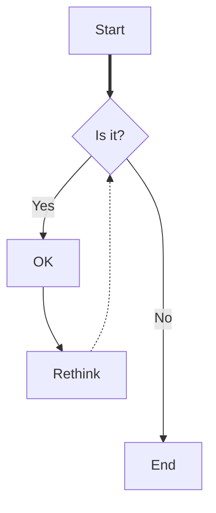

# Hello word! a mi plantilla de documentación
Esto esta hecho para ayudarte a crear un readme atractivo que llame la atención de posibles propuestas ya sea
laborales o colaborativas.
Preparate para aprender todos mis secretos :stuck_out_tongue_winking_eye:, y sobretodo preparate a documentar tus proyectos (será tu mickey-herramienta secreta) de una manera divertida.

## Empecemos
Te voy a enseñar 2 formas de hacer títulos y subtitulos
> markdown-style
> # Título
> ## subtítulo 1
> ### subtítulo 2
> #### subtítulo 3
>> ```
>> # Título
>> ## subtítulo 1
>> ### subtítulo 2
>> #### subtítulo 3
>> ```

> HTML-style
> <h1>Título</h1>
> <h2>subtítulo 1</h2>
> <h3>subtítulo 2</h3>
> <h4>subtítulo 3</h4>
> <p>párrafo</p>

>> ```html
>> <h1>Título</h1>
>> <h2>subtítulo 1</h2>
>> <h3>subtítulo 2</h3>
>> <h4>subtítulo 3</h4>
>> <p>párrafo</p>
>> ```

### Tipos de letra
Siguiendo la linea de las letras vamos con los tipos de letras que podemos emplear:

> **Negrita**
>> `**Negrita*`
>
> *Cursiva*
>> `*cursiva*`
>
> ***cursiva negrita***
>> `***cursiva negrita***`

---
## Kit básico
Vamos a dividir nuestra documentación como si de una página web se tratase:

**Título:**

# Proyecto readme-kit
si lo queremos centrado:
<h1 align="center"> Proyecto readme-kit</h1>

Índice:

- [Acerca del proyecto](#Acerca-del-proyecto)
  - [Estado del proyecto](#Estado-del-proyecto)
  - [Mis herramientas](#Mis-herramientas)
- [Empecemos](#Empecemos)
  - [Prerrequisitos](#Prerrequisitos)
  - [Mi paso a paso](#Mi-paso-a-paso)
- [Pongamoslo a prueba](#Pongamoslo-a-prueba)
- [Roadmap](#Roadmap)
---
  Versión contraida
<details>
  <summary>쯈ue voy a encontrarme?</summary>
  <ol>
    <li>
      <a href="#Acerca-del-proyecto">Acerca del proyecto</a>
      <ul>
        <li><a href="#estado-del-proyecto">Estado del proyecto</a></li>
        <li><a href="#Mis-herramientas">Mis herramientas</a></li>
      </ul>
    </li>
    <li>
      <a href="#Empecemos">Empecemos</a>
      <ul>
        <li><a href="#Prerrequisitos">Prerrequisitos</a></li>
        <li><a href="#Mi-paso-a-paso">Mi paso a paso</a></li>
      </ul>
    </li>
    <li><a href="#Pongamoslo-a-prueba">Pongamoslo a prueba</a></li>
    <li><a href="#roadmap">Roadmap</a></li>
  </ol>
</details>


## Acerca del proyecto
Aquí me gusta describir de que va mi proyecto, escribir esta parte es fundamental ya que es el gancho para que se siga leyendo tu proyecto. Procura realizar una descripción enganchante, como buena experta en marketing te puedo recomendar el formato AIDA:
> Atención
> 
> Interes
> 
> Deseo
> 
> Acción
> 
>> 쮿arto de lidiar con documentación desordenada? Con esta plantilla, crearás documentación clara y sencilla sin esfuerzo. Ahorra tiempo, evita frustraciones y deja que tu código hable por sí mismo. Pruébala, adáptala a tu estilo y disfruta de la tranquilidad de saber que todo está en su lugar. 춰Es tu oportunidad de hacer que tu documentación realmente cuente!

### Estado del proyecto
:construction: Proyecto en construcción :construction:

**:white_check_mark: Proyecto finalizdo :white_check_mark:**

### Mis herramientas
Aquí me gusta poner mi bibliografía y enlaces utiles, para mi es importante dar reconocimiento a los creadores de contenido y páginas web con información valiosa, aparte que si tengo que ayudar a un compi mejor si tengo el link de esa info a mano.

* Donde encontrar emojis chulos para tu readme: [emojis](https://tutorialmarkdown.com/emojis)
* Guía oficial de github para readme: [guía github](https://docs.github.com/es/get-started)
* Crea un readme increible: [readme increible](https://www.aluracursos.com/blog/como-escribir-un-readme-increible-en-tu-github)
* Escribe documentación en Markdown: [guía Markdown](https://experienceleague.adobe.com/es/docs/contributor/contributor-guide/writing-essentials/markdown)
* Estiliza tu readme: [readme estiloso](https://rurickdev.medium.com/qu%C3%A9-es-markdown-o-c%C3%B3mo-estilizar-el-readme-de-tus-repositorios-c48af9ce7f2a)

## Empecemos

### Prerrequisitos
En esta sección suelo poner la laundry list para que el proyecto se pueda realizar, en este caso sería:
- [x] Recopilar los patrones de mis anteriores documentaciones.
- [X] Ver como puedo crear una plantilla efectiva.
- [X] Encontrar un nombre divertido para esta carpeta.
- [X] Recopilar las páginas que siempre consulto a la hora de realizar mi readme.

 
### Mi paso a paso
Aquí viene la parte más importante en la que ayudandome de texto y contenido visual (imagen, video, grafícos...), documento mi proyecto.
Pero antes siempre me gusta poner un disclaimer por si la información quedase obsoleta o haya algún error `(estoy abierta a correcciones, así que si ves que en mi contenido hay algo erroneo no dudes en pedirme un fork o contactarme)`

> [!WARNING]
> 
> Todo lo escrito es en base a mi experiencia, cada quien tiene su propio camino y tiempo. Espero que lo tomes como un complemento a tu formación y no como las sagradas escrituras.

#### Ya que estamos suelo usar este tipo de cuadros de texto así que vamos a ponerlos:

> [!NOTE]
>
> Lo uso para poner algún enlace de una información concreta.

> [!TIP]
>
> Lo uso para destacar un truco que te facilitará la vida.

> [!IMPORTANT]
>
> Para destacar información importante.

> [!CAUTION]
>
> Resalto algún cambio de versión o si solo funciona para x sistema operativo.

---
### Imagenes
Depende si la imagen esta llena de información o solo un apoyo visual, elijo ponerla entera o si no dejarla en la parte derecha. 

**Aquí un ejemplo:**

**Diagrama**


---

**Texto plano con una imagen**

<table>
  <tr>
    <td>
<p> 
Documentar tu código trae múltiples beneficios. Facilita la comprensión del propósito y funcionamiento del código, permitiendo a otros desarrolladores y a ti mismo entenderlo rápidamente. Mejora la integración de nuevos miembros en el proyecto, simplificando su adaptación y reduciendo el tiempo de aprendizaje. Además, facilita la evolución del código a medida que el proyecto crece, haciendo que las actualizaciones y expansiones sean más manejables. La documentación también acelera la depuración, ya que proporciona una referencia clara para identificar y corregir errores. Finalmente, asegura que el conocimiento sobre el proyecto se conserve a lo largo del tiempo, incluso con cambios en el equipo.</p>
    </td>
  </tr>
</table>

---

**texto dinámico**

<div>
	<h2 align="left">Ventajas de Documentar tu Código 📘</h2>
		<!-- Me (img) -->
	<div>
		<div style="flex: 1; min-width: 150px;">
		
	</div>
		<!-- doc (text) -->
	<div style="min-width: 150px; ">
		<p>

- Claridad Instantánea: Facilita la comprensión del propósito y funcionamiento del código.
      
- Integración Rápida: Permite que nuevos desarrolladores se integren rápidamente al proyecto.

- Evolución Simplificada: Facilita la adaptación y expansión del código a medida que el proyecto crece.

- Depuración Eficiente: Acelera la identificación y corrección de errores.

- Valor Duradero: Asegura que el conocimiento del proyecto perdure más allá de los cambios en el equipo.
</p>
	</div>
  </div>
</div>

---

### Tablas

Otro de mis recursos favoritos para poder ver el contenido de un solo vistazo son las tablas, lo use bastante en mi primer proyecto [libft](https://github.com/abbyenredes/42-Madrid-Cursus/tree/main/00_libft) y aquí te enseñaré a sacarle partido:

| Función | Descripción |
| ------------- | ------------- |
| [función 1](link)  | Esta función te ayuda a ...  |
| [Función 2](link)  | Con esta función podras ...  |

> [!NOTE]
>
> Normalmente suelo usar tablas de 2 columnas pero si lo necesitas puedes usar de más.

### Código

Aquí me gusta sobretodo compartir los comandos que uso para que sea de facil acceso:

`mkdir 07_minishell`

También se puede compartir código entero, pero ya que lo subes en un archivo propio me parece demasiado, a no ser que necesites explicar algo sobre ese código que no se pueda comentar en el mismo.
Ejemplo:

```C
#include <libft.h>
int main() {
  ft_printf("Hello, World!");
   return 0;
}
```
## Pongamoslo a prueba

Esta sección la uso sobretodo para poner videos cortos poniendo a prueba mi proyecto:

### Vídeos
> [!TIP]
>
> personalmente uso windows (aunque soy fan de linux), con la combinación de estas teclas: `alt + windows + s` accedo a capturar pantalla, allí esta también la opción de capturar video. Luego edito la velocidad en [canva](https://www.canva.com/) para por último [convertirlo en gif](https://convertio.co/es/mp4-gif/) y subirlo aquí 


Aquí te mostraré un ejemplo de como creo una nueva carpeta y la preparo para realizar mi documentación, para mi es importante agregar el archivo `README.md` para agregar mi documentación y una carpeta llamada `img` para añadir el contenido visual sin sobrecargar el proyecto, esto es para que quede lo mas limpio posible.


---

<table>
  <tr>
    <td>

    </td>
  </tr>
</table>

## Roadmap
Esta sección es ideal para compartir pseudocódigo ya sea en forma de imagenes (escaneo de tus apuntes), también puedes realizar diagramas de flujo gracias a mermaid:


> [!NOTE]
>
> Te dejo este github donde recopila distintos diagramas con [mermaid](https://gist.github.com/ChristopherA/bffddfdf7b1502215e44cec9fb766dfd)

---

# Finalmente me gusta despedirme con algun gif cute


# Aquí no acaba esto
Así es, esto no acaba porque nos queda lo más importante, compartir la plantilla definitiva para crear un buen readme:

```
# Titulo

Índice:

- [Acerca del proyecto](#Acerca-del-proyecto)
  - [Estado del proyecto](#Estado-del-proyecto)
  - [Mis herramientas](#Mis-herramientas)
- [Empecemos](#Empecemos)
  - [Prerrequisitos](#Prerrequisitos)
  - [Mi paso a paso](#Mi-paso-a-paso)
- [Pongamoslo a prueba](#Pongamoslo-a-prueba)
- [Roadmap](#Roadmap)
---
  Versión contraida
<details>
  <summary>쯈ue voy a encontrarme?</summary>
  <ol>
    <li>
      <a href="#Acerca-del-proyecto">Acerca del proyecto</a>
      <ul>
        <li><a href="#estado-del-proyecto">Estado del proyecto</a></li>
        <li><a href="#Mis-herramientas">Mis herramientas</a></li>
      </ul>
    </li>
    <li>
      <a href="#Empecemos">Empecemos</a>
      <ul>
        <li><a href="#Prerrequisitos">Prerrequisitos</a></li>
        <li><a href="#Mi-paso-a-paso">Mi paso a paso</a></li>
      </ul>
    </li>
    <li><a href="#Pongamoslo-a-prueba">Pongamoslo a prueba</a></li>
    <li><a href="#roadmap">Roadmap</a></li>
  </ol>
</details>

## Acerca del proyecto

> esto
> es
> una
> caja

### Estado del proyecto
:construction: Proyecto en construcción :construction:

**:white_check_mark: Proyecto finalizdo :white_check_mark:**

### Mis herramientas
* descripción: [name](link)
* descripción: [name](link)
* descripción: [name](link)

## Empecemos

### Prerrequisitos

- [X] Tarea completa.
- [ ] Tarea pendiente.

### Mi paso a paso

> [!WARNING]
> 
> Todo lo escrito es en base a mi experiencia, cada quien tiene su propio camino y tiempo. Espero que lo tomes como un complemento a tu formación y no como las sagradas escrituras.

#### tipos de cuadros de texto:

> [!NOTE]
>
> Lo uso para poner algún enlace de una información concreta.

> [!TIP]
>
> Lo uso para destacar un truco que te facilitará la vida.

> [!IMPORTANT]
>
> Para destacar información importante.

> [!CAUTION]
>
> Resalto algún cambio de versión o si solo funciona para x sistema operativo.

---
### Imagenes

**Diágrama**


**Imagen centrada**
<table>
  <tr>
    <td>

    </td>
  </tr>
</table>

**imagen + texto plano**
<table>
  <tr>
    <td>
<p> 
texto.</p>
    </td>
  </tr>
</table>

**Imagen + texto dinamico**

<div>
	<h2 align="left">Titulo</h2>
		<!--  (img) -->
	<div>
		<div style="flex: 1; min-width: 150px;">
		
	</div>
		<!-- doc (text) -->
	<div style="min-width: 150px; ">
		<p>
	texto
</p>
	</div>
  </div>
</div>

---

### Tablas

| Función | Descripción |
| ------------- | ------------- |
| [f1](link)  | -  |
| [F2](link)  | - |

---

### Código

`comandos`

	```C <!--  (tipo de lenguaje) -->
	código completo

	```
## Pongamoslo a prueba


---

<table>
  <tr>
    <td>

    </td>
  </tr>
</table>

## Roadmap


	```mermaid
	graph TB
    	A[Start] ==> B{Is it?};
    	B -->|Yes| C[OK];
    	C --> D[Rethink];
    	D -.-> B;
    	B ---->|No| E[End];
	```
# Good Luck

```

쯊e parece muy largo?

Vamos a resumirlo aun más
> [!IMPORTANT]
>
> Si te ha sido util esta guía regalame una :star:.

```
#

<details>
  <summary>쯈ue voy a encontrarme?</summary>
  <ol>
    <li>
      <a href="#Acerca-del-proyecto">Acerca del proyecto</a>
      <ul>
        <li><a href="#estado-del-proyecto">Estado del proyecto</a></li>
        <li><a href="#Mis-herramientas">Mis herramientas</a></li>
      </ul>
    </li>
    <li>
      <a href="#Empecemos">Empecemos</a>
      <ul>
        <li><a href="#Prerrequisitos">Prerrequisitos</a></li>
        <li><a href="#Mi-paso-a-paso">Mi paso a paso</a></li>
      </ul>
    </li>
    <li><a href="#Pongamoslo-a-prueba">Pongamoslo a prueba</a></li>
    <li><a href="#roadmap">Roadmap</a></li>
  </ol>
</details>

## Acerca del proyecto

### Estado del proyecto

:construction: Proyecto en construcción :construction:

### Mis herramientas
* : []()
* : []()

## Empecemos

### Prerrequisitos

- [ ]
- [ ]

### Mi paso a paso

> [!WARNING]
> 
> Todo lo escrito es en base a mi experiencia, cada quien tiene su propio camino y tiempo. Espero que lo tomes como un complemento a tu formación y no como las sagradas escrituras.

## Pongamoslo a prueba


## Roadmap


# Good Luck


```
---

Ahora si que hemos llegado al final de esta guía, si hubiera cualquier errata, hazmelo saber.

<table>
  <tr>
    <td>

    </td>
  </tr>
</table>


